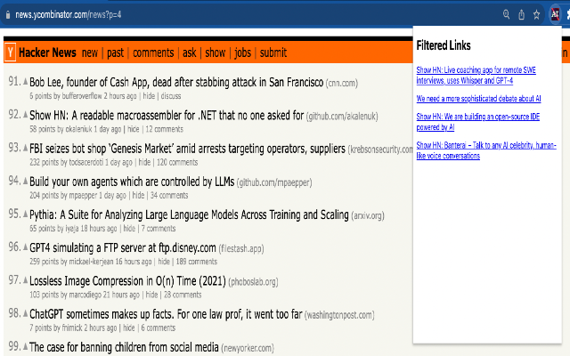

# Hacker News Link Filter Chrome Extension

This is a Chrome extension that filters out links containing AI/GPT words on the front page of Hacker News. The filtered links are displayed them in a popup when the user clicks on the extension icon.

 

# Install
1. Chrome : Pending approval
2. Firefox : Pending approval  

# To develop locally 
1. Checkout extension code and [load the extension](https://superuser.com/questions/247651/how-does-one-install-an-extension-for-chrome-browser-from-the-local-file-system)
2. Make changes and click on refresh to load latest changes. 

# How was this built?

Ironically this was built in its entirety using chat gpt. This is my first extnesion, so going from what's a manifest, code for selecting elements on ycombinator, filtering the elements, storing in local storage and displaying in popup were all done by chat gpt holding my hand. 

# Prepate for pushing to chrome/firefox web store 
1. For chrome manifest.json should not contain browser_specific_settings[source](https://stackoverflow.com/questions/56271601/chrome-extensions-do-not-respect-browser-specific-settings), remove it out and build `zip -r dist.zip *` and upload to web store. 
2. For firefox keep browser_specific_settings and build and upload. 